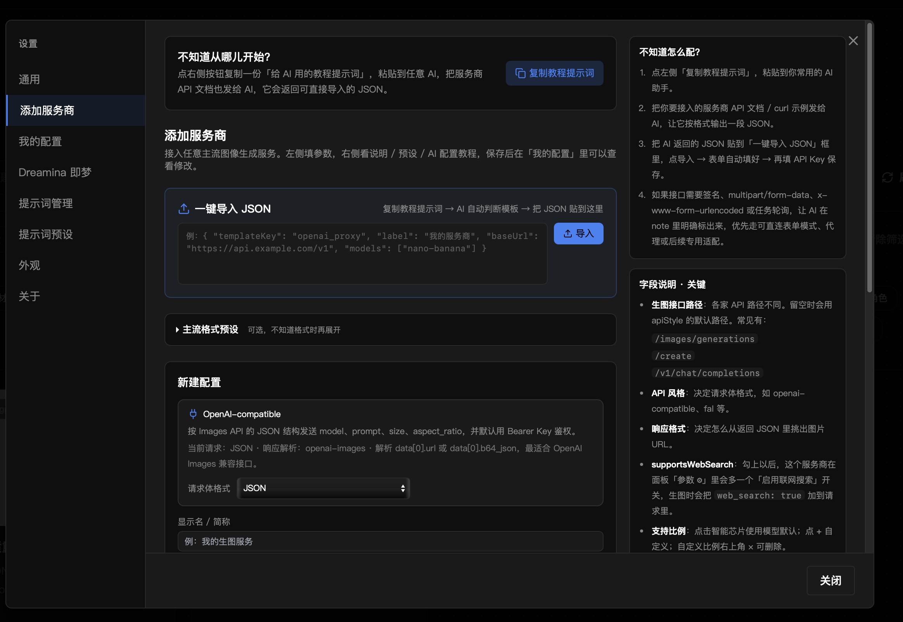
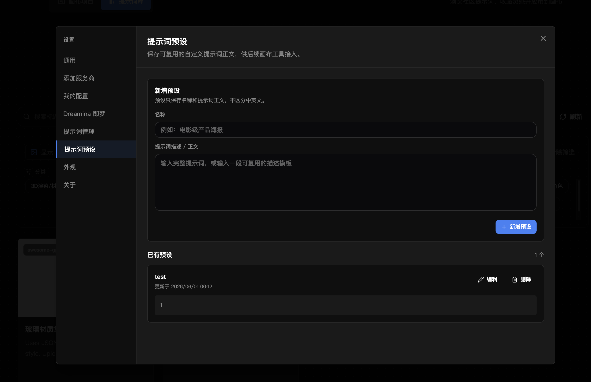
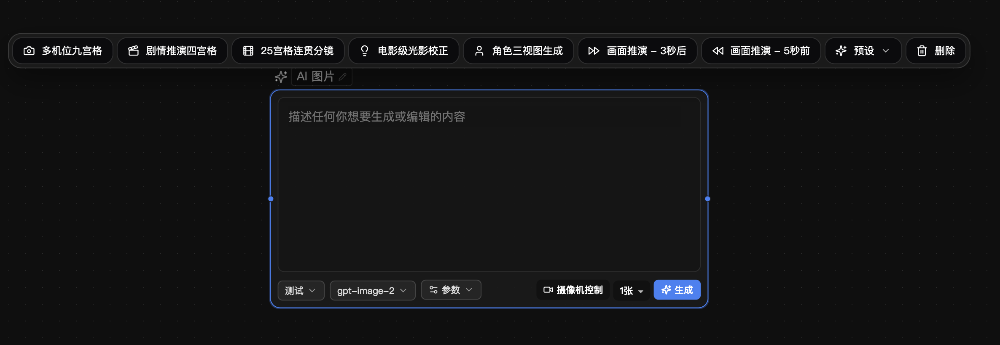
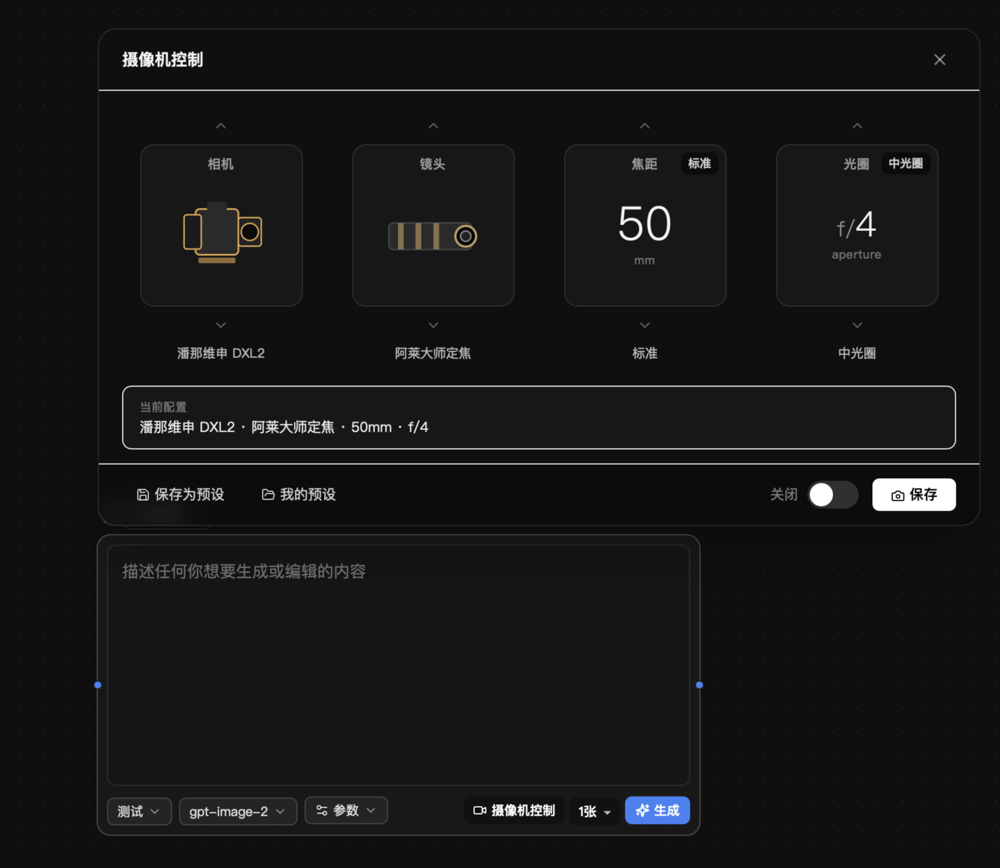
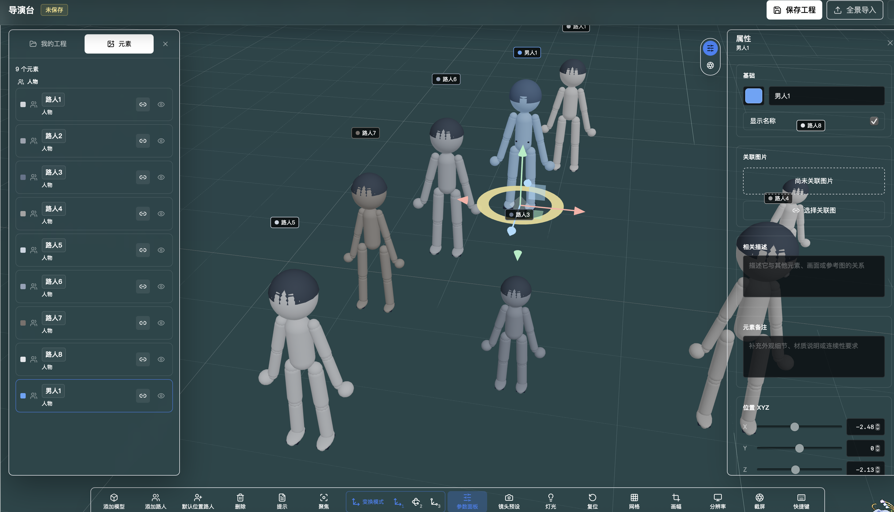
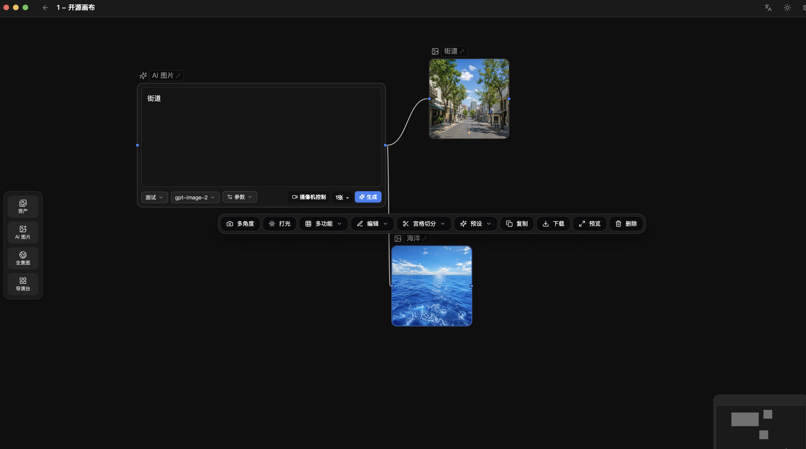
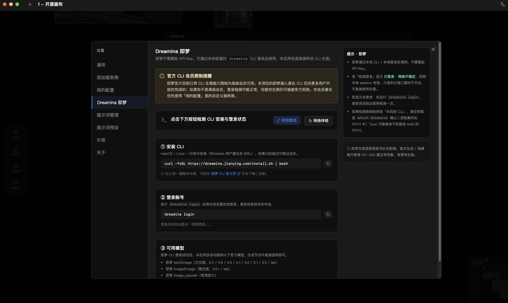

# Open Storyboard Canvas / 开源画布


开源的 AI 分镜与导演台画布，支持全景图、摄像机控制、提示词预设和多供应商调用。

## 一句话亮点

把参考图、提示词、AI 生图/编辑、全景环境和 3D 导演台场面调度放进同一个节点画布里，让分镜创作从“单次生成”变成可追踪、可复用、可继续推演的工作流。

## 项目定位

Open Storyboard Canvas 是一款基于节点画布的桌面创作工具，用于把图片上传、AI 生成/编辑、分镜拆分、全景环境、导演台场面调度和提示词工作流串联到同一个本地项目里。

它适合需要反复探索视觉方案的个人创作者、分镜设计者、短片/广告前期团队和 AI 图片工作流实验者。项目使用 Tauri 2 + React + TypeScript + Rust 构建，画布项目与图片引用默认保存在本机。

## 核心功能

- 节点画布：用上传节点、AI 图片节点、导出节点、分镜节点、全景节点和导演台节点组织创作流程。
- AI 图片生成与编辑：支持参考图、提示词、比例/分辨率、模型参数和派生结果节点。
- 导演台：在 3D 网格或全景环境中摆放人物、路人、道具、场景元素，控制相机、灯光、画幅和截图。
- 全景工作流：支持文生/图生全景、全景查看，以及把全景导入导演台作为空间背景。
- 提示词预设与提示词库：管理常用提示词模板，并把提示词应用到画布项目。
- 多供应商调用：内置供应商、用户自定义供应商和本地工具链可以通过统一设置入口管理。
- 本地项目持久化：画布节点、边、视口、历史记录和图片引用自动保存到本地数据库。
- 中英双语界面：语言包位于 `src/i18n/locales/`，欢迎补充更准确的文案。

## 适用场景

- 分镜前期：用参考图、镜头角度、灯光、分镜拆分和连续画面推演视觉方案。
- 场面调度：在导演台中摆放人物、道具、场景和全景背景，再把截图作为构图/空间参考送入 AI 图片节点。
- 多供应商实验：比较不同模型、比例、分辨率、参考图策略和自定义供应商接口。
- 提示词沉淀：把常用镜头、风格、动作和画面描述保存为预设，减少重复输入。
- 本地原型验证：在不引入云端项目管理的前提下，快速搭建个人 AI 图像工作流。

## 截图与演示

下面的演示素材来自当前版本，统一放在 `docs/imgs/readme/`。

| 场景 | 预览 |
| --- | --- |
| 提示词库：浏览社区提示词，预览详情、收藏灵感并应用到画布项目 |  |
| 添加供应商：复制教程提示词给 AI，让 AI 根据 API 文档输出可导入 JSON，再回到设置页填写和保存 |  |
| 提示词管理：集中查看内置功能提示词，切换默认语言，修改并恢复默认内容 |  |
| 提示词预设：保存常用正向提示词，后续在画布节点和图片功能栏里复用 |  |
| AI 图片节点：在同一个节点里选择供应商、模型、参数、摄像机控制、张数和预设提示词，配合参考图继续生成 |  |
| 摄像机控制：为生成请求补充相机、镜头、焦距和光圈描述，让画面更接近分镜意图 |  |
| 导演台：在 3D 网格或全景环境里摆放人物、路人、道具和场景元素，调位置、关联参考图、编辑备注、控制相机灯光画幅，并把截图回流到画布 |  |
| 图片节点功能栏：对已有图片快速执行多角度、打光、多功能、编辑、宫格切分、预设、复制、下载、预览和删除 |  |
| 全景查看器：浏览全景图，保存当前画面，生成四宫格参考图 |  |
| 导演台全景导入：把已生成或上传的全景图作为导演台空间背景，在全景里继续安排人物与镜头 |  |
| Dreamina / 即梦：可选接入本地 `dreamina` CLI，登录后使用本地 CLI 能力辅助生图 |  |

## 安装下载

正式安装包会发布到 GitHub Releases：

<https://github.com/ganbo-gab/open-storyboard-canvas/releases/latest>

Windows 用户下载 `.exe` 安装包，macOS 用户下载 `.dmg` 安装包。Windows 如果启动时报 WebView 相关错误，请安装 [Microsoft Edge WebView2 Runtime](https://developer.microsoft.com/zh-cn/Microsoft-edge/webview2#download)。

## 快速开始

```bash
git clone https://github.com/ganbo-gab/open-storyboard-canvas.git
cd open-storyboard-canvas
npm install

# 仅前端预览，适合改 UI 文案和普通组件
npm run dev

# 桌面端联调，涉及本地文件、SQLite、系统命令或 Tauri 能力时使用
npm run tauri dev
```

首次开发前建议阅读：

- [`docs/development-guides/base-tools-installation.md`](docs/development-guides/base-tools-installation.md)
- [`docs/development-guides/project-development-setup.md`](docs/development-guides/project-development-setup.md)
- [`docs/settings/provider-guide.md`](docs/settings/provider-guide.md)

## 开发命令

```bash
# 安装依赖
npm install

# 前端开发
npm run dev

# TypeScript 检查
npx tsc --noEmit

# 前端生产构建
npm run build

# 预览前端构建结果
npm run preview

# Tauri 联调
npm run tauri dev

# Tauri 打包
npm run tauri build

# Rust 检查
cd src-tauri && cargo check
```

如果修改 `package.json`、`src-tauri/Cargo.toml`、版本号、打包配置或安装包相关文件，请额外确认 lockfile 和 Tauri 配置是否需要同步。

## 供应商与 API Key 配置

Open Storyboard Canvas 不内置任何第三方供应商账号。使用 AI 生图、编辑、全景或相关自动化能力时，需要在应用设置页自行配置 API Key、供应商地址、模型参数或本地工具。

当前项目主要支持以下路线：

- 内置供应商配置：KIE、PPIO、fal、GRSAI 等，具体可用模型以应用内设置和代码注册表为准。
- 自定义供应商：支持 OpenAI 兼容接口、部分聚合器接口和自定义请求/响应字段映射。
- Dreamina / 即梦：走本地 `dreamina` CLI 登录态路线，通常不需要在本应用里粘贴 API Key。

注意事项：

- 不要把真实 API Key、供应商账号、Cookie、CLI 登录态、`.local` 文件或本地数据库提交到仓库。
- 不同供应商的计费方式、可用地区、内容政策、日志留存和数据使用规则由供应商自行决定。
- 参考图、提示词和生成参数在发起请求时会发送给你选择的供应商或本地工具链；请不要把无权处理的敏感图片或隐私内容提交给第三方。
- 自定义供应商配置保存在本地设置存储中，不应当作为公开 issue、PR 截图或日志附件上传。

## 数据与隐私

- 画布项目、节点、边、视口、历史记录和图片引用会保存到本机 Tauri 应用数据目录中的 SQLite 数据库与图片目录。
- 应用不会提供云同步账号系统；跨设备同步需要用户自行备份或迁移本地数据。
- API Key 和自定义供应商配置由本地设置存储保存。当前项目不把它们设计成可提交的配置文件，也不承诺系统级密钥保险箱能力。
- 生成请求会按照所选供应商/工具链的要求发送提示词、参考图和参数。供应商侧如何存储、审查或再处理数据，以对应供应商条款为准。
- 提交 issue 时请先移除日志、截图、项目文件中的 API Key、访问令牌、个人路径、未公开图片和客户资料。

更多安全说明见 [`SECURITY.md`](SECURITY.md)。

## 项目结构

```text
src/
  components/              # 通用组件与设置页
  features/canvas/         # 节点画布、导演台、全景、工具和模型
  features/project/        # 项目首页和项目入口
  features/promptLibrary/  # 提示词库
  features/update/         # 更新检查
  stores/                  # Zustand 状态与本地持久化协调
  commands/                # 前端到 Tauri 命令桥接
  i18n/                    # 中文/英文语言包
src-tauri/
  src/commands/            # Rust 侧 Tauri 命令
  src/ai/                  # Rust 侧 AI 供应商适配
  tauri.conf.json          # 桌面应用配置
docs/
  development-guides/      # 开发环境和扩展指南
  settings/                # 使用配置说明
  legal/                   # 授权证明材料
```

## 贡献

欢迎提交 bug、文档修正、供应商适配、模型注册、界面优化和可复现的性能问题。开始前请阅读 [`CONTRIBUTING.md`](CONTRIBUTING.md)。

最小检查建议：

```bash
npx tsc --noEmit
npm run build
git diff --check
```

如果改动 Rust/Tauri 命令、SQLite、图片处理或打包配置，请额外运行：

```bash
cd src-tauri && cargo check
```

## 路线图 / 待办

- 完善 Release 流程、安装包签名/公证说明和版本变更记录。
- 持续整理供应商配置文档，减少用户接入自定义模型时的试错成本。
- 增加更稳定的示例项目与新手教程。
- 扩展自动化检查覆盖面，特别是画布持久化、供应商请求映射和关键 UI 流程。
- 梳理历史文档与旧截图，标记哪些是当前能力，哪些只是历史参考。

## 仓库信息建议

GitHub 仓库短描述、Topics、首发前检查清单见 [`docs/release/github-repo-setup.md`](docs/release/github-repo-setup.md)。

## 授权状态说明 / License Status

本项目基于原项目 Storyboard-Copilot 二次开发，并已获得原作者公开/书面聊天授权，允许继续开发与开源。授权条件是保留原作者名称以及原项目链接。

- 原作者：痕继痕迹 / henjicc
- 原项目：<https://github.com/henjicc/Storyboard-Copilot>
- 授权截图：[`docs/legal/upstream-author-authorization-2026-05-31.jpg`](docs/legal/upstream-author-authorization-2026-05-31.jpg)
- 归属说明：[`NOTICE`](NOTICE)
- 本项目新增代码与资源：Copyright (c) 2026 ganbo-gab and contributors，以 MIT 条款发布，详见 [`LICENSE`](LICENSE)。

请在再分发、二次开发或公开展示时继续保留上述原作者名称和原项目链接。本段仅说明当前授权与归属信息，不构成法律建议。

## 免责声明

- 用户自行提供并管理 API Key、本地凭据、供应商配置和本地生成工具登录态。
- 第三方供应商产生的费用、请求失败、数据处理、内容审核、账号封禁或区域限制由用户自行负责。
- AI 生成内容可能存在版权、肖像权、商标、事实性、合规性或商业使用风险，请在发布、交付或商用前自行确认。
- 本项目不承诺任何供应商、模型、网络服务、安装包分发渠道或生成结果的稳定性。
- 本项目不是法律、版权、影视制作或商业合规建议。

## 致谢

项目开发过程中使用 OpenAI Codex 辅助工程实现与文档整理。

感谢 [Linux Do](https://linux.do) 社区。
